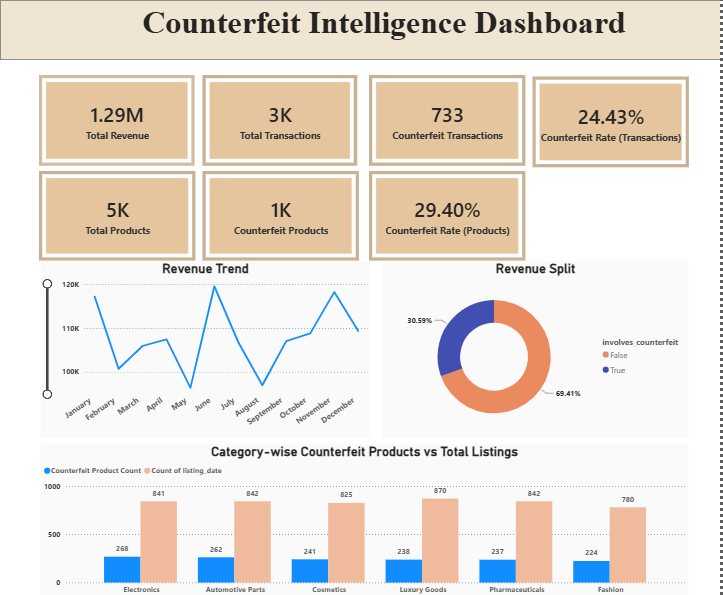
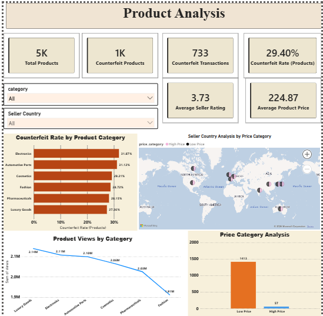
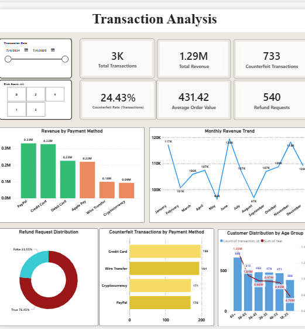
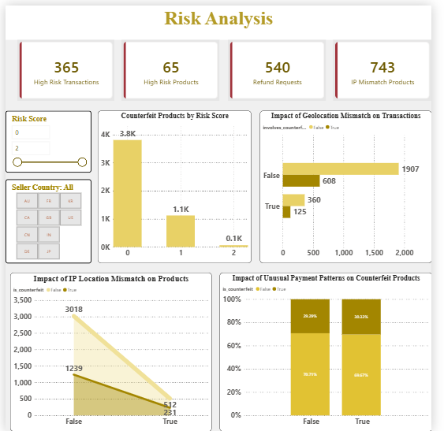

# 🛡️ Counterfeit Intelligence Dashboard
 
> End-to-end fraud detection dashboard analyzing counterfeit patterns across **5,000 product listings** and **3,000 transactions** using Python, SQL, and Power BI.
 
---
 
## 📌 Project Overview
 
Counterfeit products cause billions in losses to e-commerce platforms every year. This project builds a full analytics pipeline — from raw data cleaning to an interactive 4-page Power BI dashboard — to detect, analyze, and visualize counterfeit patterns across product listings and customer transactions.
 
The dataset covers **6 product categories**, **10+ seller countries**, and **12 months** of transaction data (July 2024 – July 2025).
 
---
 
## 🚨 Key Findings
 
| Metric | Value |
|--------|-------|
| Total Products Analyzed | 5,000 |
| Counterfeit Products Detected | 1,470 **(29.4%)** |
| Total Transactions | 3,000 |
| Counterfeit Transactions | 733 **(24.4%)** |
| Total Revenue | $1.29M |
| Revenue at Risk (Counterfeit) | **$395.9K (30.6%)** |
| Avg Seller Rating | 3.73 / 5.0 |
| Refund Requests | 540 (18% of orders) |
 
### 🔍 Critical Insight
**Low-price listings drive the majority of counterfeits** — 56.5% of low-price products were flagged as counterfeit vs only 2.3% of high-price products. Price is the single strongest indicator of fraud risk.
 
---
 
## 📊 Dashboard Pages
 
### Page 1 — Executive Summary
- KPI cards: Total revenue, transactions, counterfeit rate
- Revenue trend (monthly, Jul 2024–Jul 2025)
- Revenue split donut (legitimate vs counterfeit)
- Category-wise counterfeit vs total listings
### Page 2 — Product Analysis
- Counterfeit rate by product category (horizontal bar)
- Price category analysis (Low Price vs High Price)
- Seller country distribution (map + bar)
- Product risk score distribution
### Page 3 — Transaction Analysis
- Revenue by payment method
- Monthly revenue trend with counterfeit overlay
- Customer distribution by age group
- Counterfeit transactions by payment method
- Refund request distribution
### Page 4 — Risk Analysis
- Counterfeit products by risk score
- Impact of geolocation mismatch on transactions
- Impact of IP location mismatch on products
- Impact of unusual payment patterns on counterfeit products
- Interactive risk score slicer + seller country filter
---
 
## 🗂️ Folder Structure
 
```
counterfeit-intelligence-dashboard/
│
├── README.md
├── Data/
│   ├── counterfeit_products_cleaned.xlsx
│   └── cleaned_transactions.xlsx
├── Notebook/
│   └── counterfeit_eda.ipynb
├── SQL/
│   └── counterfeit_analysis.sql
├── Power_BI/
│   └── Counterfeit_Transaction_Patterns.pbix
└── Screenshots/
    ├── executive_summary.png
    ├── product_analysis.png
    ├── transaction_analysis.png
    └── risk_analysis.png
```
 
---
 
## 🛠️ Tech Stack
 
| Tool | Purpose |
|------|---------|
| **Python** (Pandas, NumPy) | Data cleaning, EDA |
| **SQL** | Data analysis, aggregations |
| **Power BI** | Interactive dashboard, DAX measures |
| **Jupyter Notebook** | Exploratory data analysis |
 
---
 
## ⚙️ DAX Measures Used
 
```dax
Counterfeit Rate (Products) =
DIVIDE(
    CALCULATE(COUNTROWS(counterfeit_products), counterfeit_products[is_counterfeit] = TRUE()),
    COUNTROWS(counterfeit_products)
)
 
Counterfeit Rate (Transactions) =
DIVIDE(
    CALCULATE(COUNTROWS(counterfeit_transactions), counterfeit_transactions[involves_counterfeit] = TRUE()),
    COUNTROWS(counterfeit_transactions)
)
 
Counterfeit Revenue =
CALCULATE(
    SUM(counterfeit_transactions[total_amount]),
    counterfeit_transactions[involves_counterfeit] = TRUE()
)
```
 
---
 
## 📷 Dashboard Screenshots
 
### Executive Summary


### Product Analysis


### Transaction Analysis


### Risk Analysis

---
 
## 💡 Business Recommendations
 
1. **Flag low-price listings automatically** — products priced significantly below market average should trigger a counterfeit review workflow.
2. **Prioritize Electronics and Automotive Parts** — both show counterfeit rates above 31%, the highest across all categories.
3. **Monitor geolocation mismatches** — 16.2% of transactions show geo mismatches; cross-referencing with payment method can identify fraud clusters.
4. **Velocity flag alerts** — 10.7% of transactions triggered velocity flags; real-time monitoring can reduce counterfeit transaction completion.
5. **Crypto and Wire Transfer scrutiny** — while low in volume, these payment methods disproportionately appear in counterfeit transactions.
---
 
## 🔄 Project Workflow
 
```
Raw Data
   ↓
Python (Pandas) — Cleaning & EDA
   ↓
SQL — Analysis & Aggregations
   ↓
Power BI — Dashboard & DAX Measures
   ↓
Insights & Recommendations
```
 
---
 
## 👩‍💻 Author
 
**Divya Raghavendra Konnur**
Data Analyst Intern | Computer Science Engineering
 
[](https://www.linkedin.com/in/divya-konnur)
[](https://github.com/Divyakonnur25)
[](https://divyakonnur25.github.io/AttritionIQ)
 
---
 
## 📁 Related Projects
 
- [AttritionIQ](https://github.com/Divyakonnur25/AttritionIQ) — HR attrition analysis on IBM dataset (1,470 records) using Python, SQL, and Power BI
- Google Play Store Analysis — app performance analysis on ~10,000 records
---
 
*Built as part of a self-directed data analytics portfolio. All data is synthetically generated for educational purposes.*
